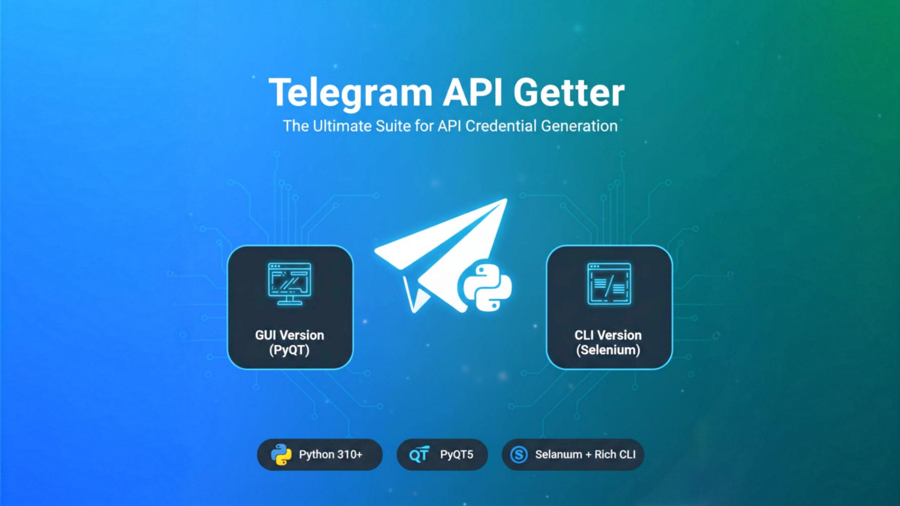
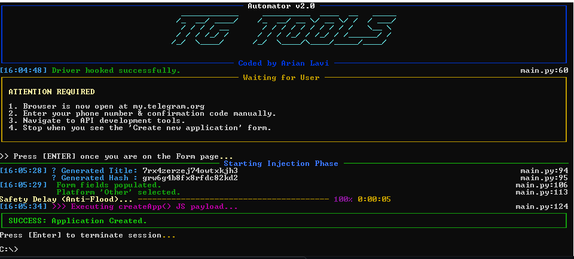

<div align="center">

# 🚀 Telegram API Getter: The Ultimate Suite
### Automated Credential Extraction (`api_id` & `api_hash`)


<p align="center">
  <b>A professional-grade toolkit to generate Telegram API credentials instantly.</b><br>
  <i>Choose your weapon: The robust <b>Desktop GUI</b> or the lightning-fast <b>Terminal CLI</b>.</i>
</p>



</div>

---

## 🚀 Features

Whether you prefer a visual interface or a command-line tool, this repository has you covered.

| Feature | 🖥️ GUI Version (v1) | ⚡ CLI Version (v2) |
| :--- | :---: | :---: |
| **Core Engine** | `Requests` + `BeautifulSoup` | `Selenium WebDriver` |
| **Interface** | PyQt5 Desktop App | Rich Terminal UI |
| **OS Support** | Windows / Linux / Mac | **Cross-Platform** (Anywhere) |
| **Best For** | Casual Users & Visual Feedback | Developers & Headless Servers |
| **Automation** | Standard HTTP Requests | Full Browser Emulation |

---

## 🖥️ Mode 1: GUI Application (PyQt5)

The classic, user-friendly desktop application. Perfect for users who want a "point-and-click" experience.

### ✨ Highlights
* **Visual Dashboard:** Clean material-design inspired interface.
* **Log Monitor:** Real-time activity logging window.
* **One-Click Copy:** Instantly copy `api_id` and `api_hash` to clipboard.
* **Session Management:** Handles login flows with visual prompts.

### 📸 Screenshots v1
<p align="center">
  
</p>

---

## ⚡ Mode 2: CLI Tool (Selenium + Rich)

**NEW!** A high-performance, It uses `Selenium` to emulate a real browser (bypassing complex bot detections) and `Rich` for a beautiful terminal output.


### ✨ Highlights
* **Browser Emulation:** Uses a real Chrome instance to mimic human behavior perfectly.
* **Smart Waits:** No fixed delays; the bot reacts instantly to page loads.
* **Headless Ready:** Can be configured to run on servers without a monitor.

### 📸 Screenshots v2
<p align="center">
  
</p>

### 🚀 Usage (CLI)
After installing dependencies, simply run:
```bash
python main-v2.py
````

*(Note: Ensure you rename the CLI script to `main-v2.py` or similar)*

-----

## 💻 Installation

To run either version, follow these steps:

### 1\. Clone the Repository

```bash
git clone https://github.com/Arianlavi/telegram-api-getter.git
cd telegram-api-getter
```

### 2\. Install Dependencies

We have separated dependencies for clarity.

**For GUI Version (PyQt5):**

```bash
pip install PyQt5 requests beautifulsoup4 pyperclip
```

**For CLI Version (Selenium/Rich):**

```bash
pip install selenium webdriver-manager rich pyfiglet
```

> **Pro Tip:** You can install everything at once:
>
> ```bash
> pip install -r requirements.txt
> ```
>
> *(Ensure your `requirements.txt` includes all the libraries above)*

-----

## 🛠️ Code Overview

The project is structured with modularity in mind:

  * **`main.py` (GUI):** Handles the Event Loop, UI rendering (PyQt5), and HTTP requests logic.
  * **`main-v2.py` (CLI):** Orchestrates the Selenium WebDriver, handles the DOM interactions, and renders the Rich TUI.
  * **Advanced Logging:** Both versions utilize structured logging to help debug login issues.

-----

## 💸 Support & Donations

If this tool saved you time or helped your project, consider supporting the development\! Your contributions help maintain the repo and add new features.

| Cryptocurrency | Address | Network |
|---------------|---------|---------|
| **Bitcoin (BTC)** | `bc1q3r79a2t3tuada56zv722ykrwjadgsh79m5pthz` | Bitcoin |
| **Ethereum (ETH) / USDT** | `0x66D74F4b7527ea9eD5BA5e2E02fa93fB7a90325d` | ERC-20 |
| **Solana (SOL)** | `9irdHFdeWVb6cnu8HTdKAs3Lg1PD8HiQQLhVHLSAQq6X` | Solana |

> **⚠️ Important:**
>
>   * Always **double-check** the address before sending.
>   * Donations are non-refundable.
>   * Use a secure wallet like [Exodus](https://exodus.com) or [Trust Wallet](https://trustwallet.com).

### ⭐ Other Ways to Support

  * Star this repository on GitHub.
  * Open an Issue if you find a bug.
  * Submit a Pull Request to improve the code.

-----

## ⚠️ Disclaimer

  * **Educational Use Only:** This tool is intended for developers to automate their own workflow.
  * **Terms of Service:** Use this responsibly and in accordance with Telegram's ToS.
  * **No Liability:** The creator is not responsible for any account limitations caused by misuse.

-----

## 📬 Contact

Created by **Arian Lavi**

  * 🌐 GitHub: [Arianlavi](https://github.com/arianlavi)
  * ✈️ Telegram: [@Arianlvi](https://t.me/Arianlvi)

<div align="center"\>
<sub\>Built with 💙 and Python</sub\>
</div\>
