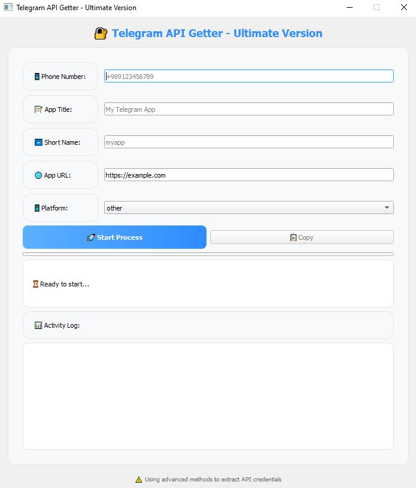

# Telegram API Getter - Ultimate Version


A powerful Python tool with GUI to automatically generate Telegram API credentials (API ID & API Hash) for your applications. Designed for developers, testers, and Telegram enthusiasts.

---

## 🚀 Features

* Send confirmation code to Telegram accounts
* Sign in with verification code
* Automatically create Telegram applications
* Retrieve API credentials (API ID & API Hash) with advanced extraction methods
* JavaScript-like automation methods for robustness
* User-friendly PyQt5 GUI
* Activity log for monitoring the process
* Copy credentials to clipboard with one click

---

## 🖥️ Screenshots


*Note: Replace with your actual screenshot.*

---

## 💻 Installation

1. Clone the repository:

```bash
git clone https://github.com/yourusername/telegram-api-getter.git
cd telegram-api-getter
```

2. Install dependencies:

```bash
pip install -r requirements.txt
```

Dependencies include:

* `PyQt5`
* `requests`
* `beautifulsoup4`
* `pyperclip`

---

## ⚡ Usage

Run the application:

```bash
python main.py
```

Steps:

1. Enter your Telegram phone number.
2. Provide app details: title, short name, URL, and platform.
3. Click **Start Process**.
4. Enter the verification code sent to your Telegram.
5. Wait for the tool to create the app and retrieve API credentials.
6. Copy the credentials with one click.

---

## 🛠️ Code Overview

The tool is built with:

* **Python 3**
* **PyQt5** for GUI
* **Requests** for HTTP interactions
* **BeautifulSoup** for HTML parsing
* Advanced logging and error handling

---

## Support & Donations
If you find PyPack helpful, please consider supporting the project with a donation! Your contributions help keep the project alive and improve its features.
You can send donations to the following wallet addresses. **Always verify the address before sending!**

| Cryptocurrency | Address | Network |
|---------------|---------|---------|
| **Bitcoin (BTC)** | `bc1q3r79a2t3tuada56zv722ykrwjadgsh79m5pthz` | Bitcoin |
| **Ethereum (ETH) / USDT** | `0x66D74F4b7527ea9eD5BA5e2E02fa93fB7a90325d` | ERC-20 |
| **Solana (SOL)** | `9irdHFdeWVb6cnu8HTdKAs3Lg1PD8HiQQLhVHLSAQq6X` | Solana |

**Important**:
- **Replace the above addresses with your own wallet addresses.**
- Copy-paste addresses exactly to avoid errors.
- Donations are non-refundable, so double-check before sending.
- For security, use a trusted wallet like [Exodus](https://exodus.com) or [Trust Wallet](https://trustwallet.com).

### Other Ways to Support
- Give the project a ⭐ on GitHub.
- Share PyPack with your friends or on social media.
- Contribute by submitting pull requests or reporting issues.

---

## ⚠️ Disclaimer

* Use responsibly. Only for your own Telegram accounts.
* Do not use for spam, phishing, or any illegal activity.
* Telegram may restrict accounts if abused.

---

## 💡 Contributing

Contributions are welcome!

* Fork the repository
* Create a new branch
* Submit a pull request

---

## 📄 License

This project is licensed under the MIT License. See the [LICENSE](LICENSE) file for details.

---

## 📬 Contact

Created by **Arian Lavi**

* GitHub: [yourusername](https://github.com/arianlavi)
* Telegram: [@yourtelegram](https://t.me/Arianlvi)
